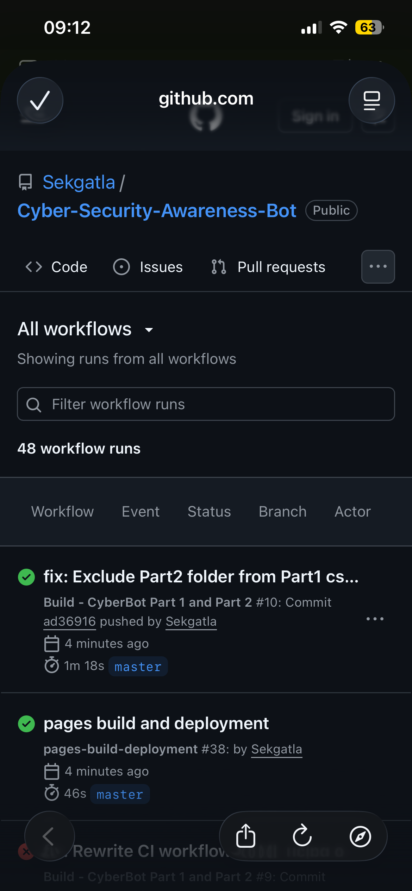

<div align="center">

  ```
     ____      _               ____             
    / ___|   _| |__   ___ _ __/ ___|  ___  ___ 
   | |  | | | | '_ \/ _ \ '__\___ \ / _ \/ __|
   | |__| |_| | |_) |  __/ |   ___) |  __/ (__ 
    \____\__, |_.__/ \___|_|  |____/ \___|\___|
         |___/                                  
  ```

  # 🛡️ Cybersecurity Awareness Bot

  **Created by Sekgatla** &nbsp;·&nbsp; IIE University &nbsp;·&nbsp; PROG6221 Programming 2A

  [](https://github.com/Sekgatla/Cyber-Security-Awareness-Bot/actions)
  [](https://dotnet.microsoft.com/)
  [](https://docs.microsoft.com/dotnet/csharp/)
  [](https://microsoft.com/windows)

  > *"In a world where cyber threats grow every day — knowledge is your best defence."*

  </div>

  ---

  ## 📖 Overview

  The **Cybersecurity Awareness Bot** educates South African citizens about online threats. It comes in two parts:

  | Part | Type | Description |
  |------|------|-------------|
  | **Part 1** | C# Console App | Keyword recognition, colour-coded responses, voice greeting, session stats |
  | **Part 2** | C# WPF GUI | Full graphical interface, sentiment detection, memory recall, delegate usage |

  ---

  ## ⚙️ GitHub Actions CI — Successful Build

  Both projects build automatically on every push via GitHub Actions.

  > 📸 **Screenshot of successful CI run (green check mark):**

  

  *To update: go to [Actions tab](https://github.com/Sekgatla/Cyber-Security-Awareness-Bot/actions) → click the latest run → screenshot the green checkmarks → save as `assets/ci-screenshot.png`*

  ---

  ## 📁 Part 1 — Console Application

  ### Structure

  ```
  ├── .github/workflows/dotnet.yml  ← CI: builds Part 1 AND Part 2 on every push
  ├── Program.cs                    ← Entry point
  ├── Chatbot.cs                    ← Main orchestrator + 9-topic response engine
  ├── ConsoleHelper.cs              ← UI utilities (colours, typing, borders, prompts)
  ├── AudioPlayer.cs                ← WAV greeting with text fallback
  ├── User.cs                       ← Name, SessionId, timestamps, message count
  ├── CyberBot.csproj               ← .NET 8 Windows console project
  └── greeting.wav                  ← Voice greeting audio asset
  ```

  ### Features

  | Feature | Description |
  |---------|-------------|
  | 🎨 ASCII Art Logo | CyberSec logo on every launch |
  | 🔊 Voice Greeting | WAV audio via `SoundPlayer` with text fallback |
  | 👤 Name Validation | Checks empty · short · long · invalid characters |
  | 🛡️ 9 Topics | DANGER / WARNING / SAFE / INFO colour severity |
  | ⌨️ Typing Effect | Character-by-character animation |
  | 🔢 Suggestions | Numbered shortcuts after every response |
  | 🔄 Follow-ups | "Tell me more" continues last topic |
  | 📊 Session Stats | Message count + duration on exit |

  ### Run Part 1

  ```bash
  git clone https://github.com/Sekgatla/Cyber-Security-Awareness-Bot.git
  cd Cyber-Security-Awareness-Bot
  dotnet run
  ```

  ---

  ## 🖥️ Part 2 — WPF GUI Application

  ### Structure

  ```
  Part2/
  ├── App.xaml / App.xaml.cs         ← WPF application entry point
  ├── MainWindow.xaml                 ← Dark-themed GUI layout
  ├── MainWindow.xaml.cs              ← Thin event handler — only calls ChatBot
  ├── ChatBot.cs                      ← Central router: name → follow-up → sentiment → keyword
  ├── KeywordResponder.cs             ← Dictionary<string, List<string>> — 8 topics, random picks
  ├── SentimentDetector.cs            ← Enum + Dictionary — detects Worried/Curious/Frustrated/Happy
  ├── MemoryStore.cs                  ← Stores UserName, FavouriteTopic; personalises responses
  ├── CybersecurityChatbot.csproj     ← .NET 8 Windows WPF project
  └── assets/greeting.wav             ← Voice greeting (copied to output automatically)
  ```

  ### Part 2 Features

  | Feature | Marks | Implementation |
  |---------|-------|----------------|
  | 🖥️ GUI Design | 10 | Dark WPF layout — navy/cyan/white theme, ASCII art header |
  | 🔑 Keyword Recognition | 15 | `KeywordResponder` — 8 keywords, `Dictionary<string,List<string>>` |
  | 🎲 Random Responses | 10 | `_random.Next()` selects from each keyword's response list |
  | 🔄 Conversation Flow | 10 | Follow-up phrases ("tell me more") re-use `_lastTopic` |
  | 🧠 Memory & Recall | 10 | `MemoryStore` stores name + favourite topic; personalises replies |
  | 😊 Sentiment Detection | 10 | 5-state enum; auto-prepends empathetic opener before tip |
  | 🏗️ Code Optimisation | 10 | 4 classes; no God class; delegate for response formatting |
  | 📦 GitHub & Releases | 10 | 6+ commits; 2 tagged releases (v1.0, v2.0) |

  ### Delegate Usage

  The assignment requires delegates. `ResponseTransformer` is declared in `ChatBot.cs`:

  ```csharp
  // Delegate type: transforms a raw response before displaying it
  public delegate string ResponseTransformer(string rawResponse);

  // Used in ProcessInput() to apply sentiment opener + personalisation:
  ResponseTransformer applyContext = delegate(string raw)
  {
      return sentimentOpener + _memory.GetPersonalisedOpener() + raw;
  };
  return applyContext(keywordResponse);
  ```

  ### Generic Collection Usage

  `KeywordResponder` uses `Dictionary<string, List<string>>` — keys are cybersecurity keywords, values are lists of multiple randomised responses. This satisfies the generic collection requirement.

  ### Run Part 2

  Open `Part2/CybersecurityChatbot.csproj` in Visual Studio 2022, then press **F5**.

  > **Requirement:** .NET 8 SDK + Windows OS (for WPF and SoundPlayer)

  ---

  ## 🛡️ Cybersecurity Topics Covered (Both Parts)

  | # | Topic | Severity |
  |---|-------|----------|
  | 1 | 🔐 Password Safety | 🟡 WARNING |
  | 2 | 🎣 Phishing | 🔴 DANGER |
  | 3 | 🌐 Safe Browsing | 🟡 WARNING |
  | 4 | 🦠 Malware | 🔴 DANGER |
  | 5 | 🎭 Social Engineering | 🔴 DANGER |
  | 6 | 🔒 Two-Factor Auth | 🟢 SAFE |
  | 7 | 📶 Public Wi-Fi | 🟡 WARNING |
  | 8 | 🕵️ Privacy | 🟡 WARNING |
  | 9 | 💸 Online Scams | 🔴 DANGER |

  ---

  ## 📺 Video Presentation

  🎥 **[https://youtu.be/esOEIdVb6EA](https://youtu.be/esOEIdVb6EA)**

  ---

  ## 📚 References

  - Pieterse, H. 2021. *The Cyber Threat Landscape in South Africa: A 10-Year Review.* African Journal of Information and Communication, 28(28). https://doi.org/10.23962/10539/32213
  - SAPS Cybercrime: [www.saps.gov.za](https://www.saps.gov.za)
  - SABRIC: [www.sabric.co.za](https://www.sabric.co.za)

  ---

  <div align="center">

  **Emergency: 10111** &nbsp;·&nbsp; **Cybercrime: [www.saps.gov.za](https://www.saps.gov.za)** &nbsp;·&nbsp; **SABRIC: [www.sabric.co.za](https://www.sabric.co.za)**

  *PROG6221 Programming 2A &nbsp;·&nbsp; IIE University &nbsp;·&nbsp; Sekgatla*

  </div>
  